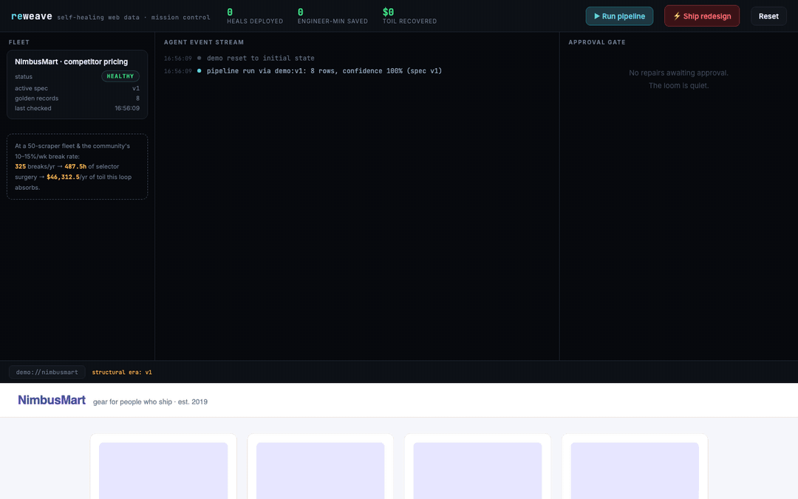
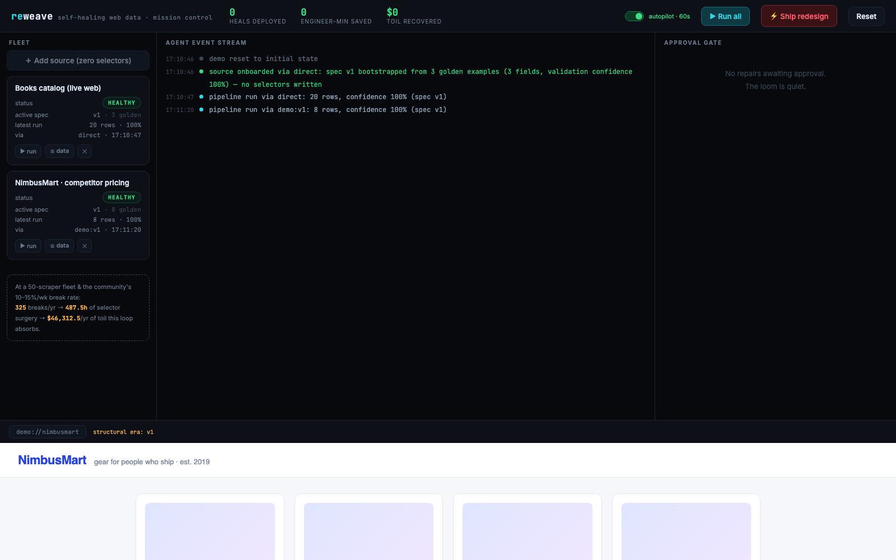
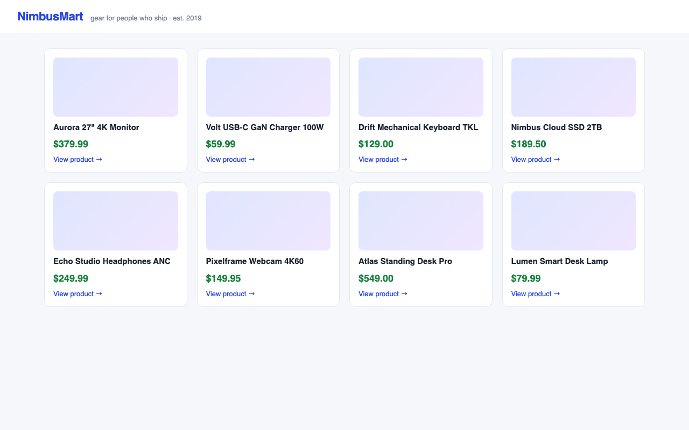
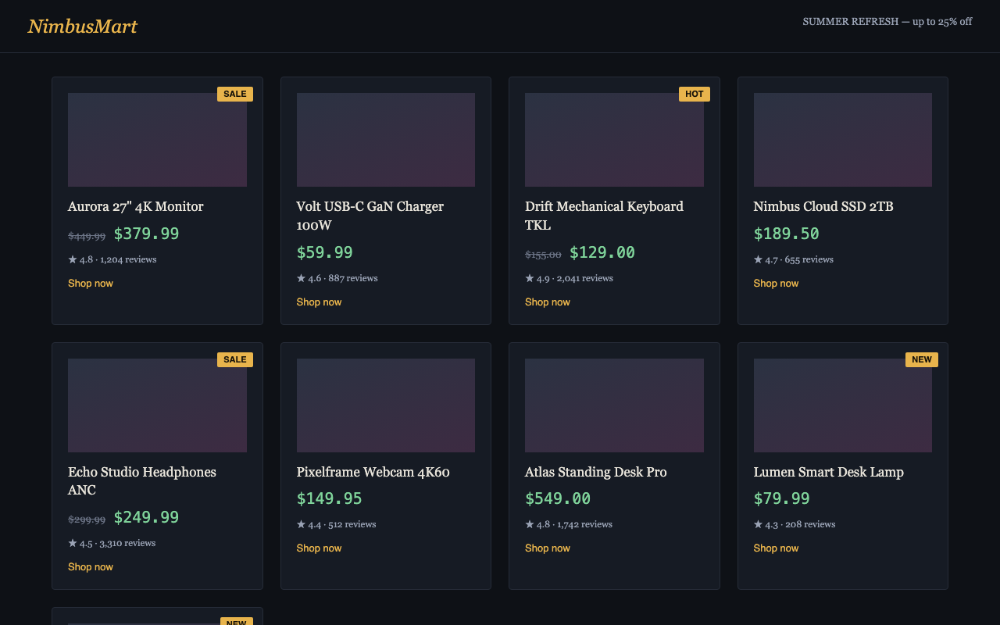
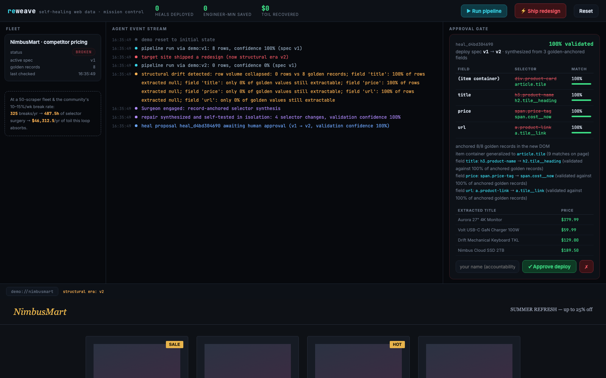

<div align="center">

# 🧵 reweave

**Self-healing web data pipelines.**
*Break the site. Watch the agent stitch it back.*

[](https://github.com/vnmoorthy/reweave/actions/workflows/ci.yml)
[](https://github.com/vnmoorthy/reweave/releases)
[](https://www.python.org/)
[](https://github.com/astral-sh/ruff)
[](LICENSE)
[](docs/architecture.md#mcp-surface)
[](https://github.com/truefoundry/trueforge)
[](https://brightdata.com)

[Website](https://vnmoorthy.github.io/reweave/) ·
[Architecture](docs/architecture.md) ·
[ADRs](docs/adr) ·
[Healing protocol](docs/architecture.md#the-healing-protocol) ·
[Demo in 90 seconds](#-the-90-second-demo) ·
[Changelog](CHANGELOG.md)



<sub>*One unedited loop, twice: the site redesigns, the agent synthesizes a validated repair, a human approves it at the gate, the pipeline goes green — then the site redesigns **again** and the healed spec heals again. No selector was written by a human.*</sub>

</div>

---

## The treadmill

Every team that extracts data from the web is on the same treadmill. The community's own numbers (r/webscraping):

- **10–15% of scrapers break every single week** when target sites change structure.
- One person can maintain ~100 scrapers. **Nobody can maintain 200.**
- The worst failures are **silent** — the job exits 0 and writes empty or wrong rows into downstream pricing, dashboards, and models for days.
- A "simple" selector fix is never simple: triage → reproduce → rewrite → test → deploy → backfill ≈ **90 engineer-minutes**, every time, forever.

At a 50-scraper fleet that compounds to **~325 breaks and ~487 engineer-hours (~$46,000) a year** of pure toil.

## What reweave does

Reweave is an autonomous repair agent for that loop — with a human in command of every deploy:

```
        ┌────────────┐     drift      ┌────────────┐   validated    ┌────────────┐
  fetch │  SENTINEL  │ ─────────────▶ │  SURGEON   │ ─────────────▶ │    GATE    │
 ─────▶ │  detects   │                │ synthesizes│                │  a human   │
        │  breakage  │ ◀───────────── │  a repair  │                │  approves  │
        └────────────┘   redeployed   └────────────┘                └─────┬──────┘
              ▲                                                          │
              └────────────────── spec v(N+1) activated ◀────────────────┘
```

1. **The Sentinel** validates every extraction against *golden records* — facts known to be true. It catches silent failures: row-volume collapse, null-rate spikes, golden values that stopped being extractable.
2. **The Surgeon** performs **record-anchored selector synthesis**: it re-locates the golden facts in the redesigned DOM, infers the new item containers, generalizes shared CSS signatures into candidate selectors, and accepts only candidates that reproduce the golden data. (Optional LLM candidates go through *exactly the same validation* — evidence over vibes.)
3. **The Gate** quarantines the repair. A named human sees the full before/after selector diff, per-field match rates, and sample rows — and only their explicit approval activates spec `v(N+1)`. Every decision lands in an audit ledger with the actor's name.

The result: a 90-minute manual fix becomes a **30-second review-and-approve**, and nothing ever deploys itself.

## 🚀 Quickstart

```bash
git clone https://github.com/vnmoorthy/reweave && cd reweave
pip install -e ".[dev]"
reweave serve          # mission control on http://localhost:8321
```

Then run the loop from the dashboard — or entirely from the CLI:

```bash
reweave run nimbusmart   # healthy: 8 rows, confidence 100%
reweave chaos            # the target site ships a redesign 💥
reweave run nimbusmart   # drift detected → repair synthesized → parked at the gate
```

## ✨ Zero selectors, ever — even on day one

Onboarding uses the same synthesis machinery as healing. You never write a
selector: paste a URL plus **2+ golden examples** (records you can literally
see on the page), and the Surgeon derives and validates the extraction spec
from your examples — then keeps it healed forever:

```bash
curl -X POST localhost:8321/api/sources -H 'Content-Type: application/json' -d '{
  "name": "Books catalog (live web)",
  "url": "http://books.toscrape.com/",
  "golden": [
    {"title": "A Light in the Attic",  "price": 51.77, "url": "a-light-in-the-attic_1000/index.html"},
    {"title": "Tipping the Velvet",    "price": 53.74, "url": "tipping-the-velvet_999/index.html"},
    {"title": "Sharp Objects",         "price": 47.82, "url": "sharp-objects_997/index.html"}
  ]}'
# → spec v1 synthesized (article.product_pod / img.thumbnail@alt / p.price_color)
# → first run: 20 rows, 100% confidence — from 3 pasted examples
```

The synthesis handles the real web's mess: it anchors values in node *text*
or in *attributes* (that catalog truncates long titles to "A Light in the …"
and carries the full title in `title=`/`alt=` — Reweave figures that out and
validates it against your examples). Same thing from the dashboard's
**＋ Add source** button, or `reweave add <url> --golden examples.json`.

**And the data actually flows:** every run's rows are stored (last 20 runs
per source), browsable in the dashboard's data drawer, and exportable:

```bash
curl "localhost:8321/api/sources/<source-id>/rows?fmt=csv" > rows.csv
reweave export <source-id> --csv
```

**Autopilot** monitors every source continuously in the background
(`REWEAVE_WATCH_INTERVAL`, default 60s) — detection and repair-synthesis run
around the clock; deploys still wait for a human at the gate.

<div align="center">

<br><sub>*A real site onboarded from 3 pasted examples: spec v1 synthesized, 20 rows extracted, autopilot watching.*</sub>
</div>

## 🎬 The 90-second demo

The repo ships with a breakable storefront (three complete front-end "eras" of the same site). In the dashboard:

| | |
|---|---|
| **1. Run pipeline** | 8 products extracted, 100% confidence. |
| **2. ⚡ Ship redesign** | The storefront visibly redesigns *in the embedded target-site pane* — every selector the pipeline relied on is now gone. |
| **3. Run pipeline** | The Sentinel reports the drift with named failures. The Surgeon anchors 8/8 golden records in the new DOM, synthesizes four new selectors, self-tests them, and parks a 100%-validated repair at the gate. |
| **4. Approve** | Type your name (approvals are accountable), approve, and the pipeline is green again on spec v2 — with $142.50 of recovered toil booked to the impact ledger. |
| **5. Do it again** | Ship the *second* redesign (a utility-class rebuild). The healed spec heals again. |

<div align="center">
 
<br><sub>*The same store, before and after the chaos button. Titles, prices and links survive; every selector dies.*</sub>
<br><br>

<br><sub>*The gate, up close: per-field `old → new` selector diffs, validation match rates, extracted sample rows — and an approval that requires a name.*</sub>
</div>

## 🛡️ Safety model

Reweave treats "agent deploys its own code change" as the risk it is:

- **Two independent gates.** The MCP surface annotates `approve_heal` with `destructiveHint`, so a conforming harness (TrueForge's approval policy, Claude Code's permission prompt) interposes a human *before the tool call* — and Reweave's own `ApprovalGate` still requires an accountable actor *inside* the call. Defense in depth.
- **Immutable spec versions.** A heal never mutates history; it writes `v(N+1)` and moves a pointer. Rollback is a pointer move.
- **Evidence-gated synthesis.** A selector that cannot reproduce the golden records does not become a proposal, whether it came from the synthesizer or an LLM.
- **Append-only audit ledger.** Who approved what, when, and what it changed — queryable forever.

## 🔌 Runs inside TrueForge

Reweave is an [MCP server](docs/architecture.md#mcp-surface). Register it in [TrueForge](https://github.com/truefoundry/trueforge) with the shipped [approval policy](harness/trueforge.mcp.json) and the [`reweave-operator` skill pack](skills/reweave-operator/SKILL.md):

```jsonc
{ "mcpServers": { "reweave": { "command": "reweave", "args": ["mcp"] } },
  "approvalPolicy": { "reweave": { "approve_heal": "always_ask" } } }
```

The harness's agent triages incidents, reads proposals, and *asks its human* — the SKILL.md pack pins the operating rules (never approve without an explicit instruction; recommend rejection under 90% validation confidence).

For hostile production sites, set `BRIGHTDATA_API_KEY` and fetching routes through **Bright Data Web Unlocker** automatically — every page carries provenance (`brightdata:zone`, `direct`, `demo:v2`) into the audit log.

## 🏭 Run it like infrastructure

Reweave ships with the operational surface a production deployment expects:

```bash
docker compose up                       # containerized, /data volume, healthcheck built in
curl localhost:8321/api/health          # {"status":"ok","version":"0.3.0","uptime_s":…}
curl localhost:8321/metrics             # Prometheus: runs, drift, heals, $ recovered, per-status gauges
```

- **Webhooks** — set `REWEAVE_WEBHOOK_URL` and every lifecycle event
  (`drift_detected`, `heal_pending`, `heal_approved`, `rollback`, …) is
  POSTed as JSON with a Slack-compatible `text` field. Best-effort by design:
  a dead endpoint can never stall a pipeline run.
- **One-move rollback** — `POST /api/sources/{id}/rollback` (or the `↩`
  button): immutable spec versions make a bad approval recoverable in
  seconds, with the actor recorded in the ledger.
- **API auth** — set `REWEAVE_API_TOKEN` to require a bearer token on every
  `/api/` route; `/api/health` stays open for load balancers and the
  dashboard prompts for the token once.
- **Fast where it counts** — the whole repair path is milliseconds
  ([measured](benchmarks/RESULTS.md), Apple M3, median of 25 runs): full heal
  synthesis **6.7ms**, bootstrap-from-examples **2.3ms**, drift assessment
  **0.04ms**. Healing is effectively free next to one human context switch.
- **[Deploy guide](docs/deploy.md)** · **[API reference](docs/reference.md)**
  · **[FAQ](docs/faq.md)** · **[Benchmarks](benchmarks/RESULTS.md)**

## 🧪 Tested like infrastructure

```bash
python -m pytest      # 26 tests, including the full lifecycle E2E
```

The E2E suite proves the whole story: healthy → redesign → drift → synthesis → *nothing deploys on rerun* → human approves → healthy on v2 → impact booked. Plus: healing the second redesign *from the healed spec*, refusing to heal when the facts are gone, rejection flows, and double-approve conflicts.

## 📐 Project layout

```
reweave/
├── reweave/                 # the package
│   ├── extractor.py         # deterministic spec execution (all intelligence lives upstream)
│   ├── sentinel.py          # golden-record drift detection
│   ├── surgeon.py           # record-anchored selector synthesis
│   ├── gates.py             # accountable approval gate (manual/assisted/auto tiers)
│   ├── pipeline.py          # the observe→orient→decide loop
│   ├── registry.py          # SQLite: immutable spec versions, incidents, audit ledger
│   ├── fetch.py             # Bright Data Web Unlocker / direct / demo, with provenance
│   ├── impact.py            # the toil-recovered ledger (defensible math, sourced)
│   ├── server.py            # FastAPI control plane
│   └── harness/mcp_server.py# dependency-free MCP stdio server
├── dashboard/               # single-file mission control UI
├── demo/                    # the breakable storefront (3 structural eras) + golden records
├── examples/                # real_source.py — monitor live books.toscrape.com
├── skills/reweave-operator/ # TrueForge SKILL.md instruction pack
├── harness/                 # TrueForge MCP registration + approval policy
├── tests/                   # 26 tests incl. full-lifecycle E2E
└── docs/                    # architecture deep dive + ADRs + assets
```

## 🤔 How is this different from…

**…an LLM that rewrites my scraper?** LLM output is a *candidate source*, not the mechanism ([ADR-0001](docs/adr/0001-record-anchored-selector-synthesis.md)). Reweave's primary repair path is deterministic golden-record anchoring — explainable, token-free, offline-capable — and *every* candidate, LLM or synthesized, must reproduce your known-true data before it can even become a proposal. A hallucinated selector structurally cannot reach production.

**…auto-healing scraper SaaS?** Two differences: the **approval gate is the product**, not a checkbox — full before/after diffs, accountable actors, an append-only audit ledger, one-move rollback ([ADR-0002](docs/adr/0002-two-layer-approval-gate.md), [ADR-0003](docs/adr/0003-immutable-spec-versions.md)); and it's **MIT-licensed infrastructure you run yourself**, exposed as an MCP server any agent harness can drive.

**…retrying with better selectors written by hand?** That's the treadmill. The point is that the *fix itself* is synthesized, validated, and versioned — the human's job shrinks from "spend 90 minutes in devtools" to "read a diff and click approve."

## 🗺️ Roadmap

- **Drift prediction** — schedule canary runs when a site's asset fingerprints churn, catching redesigns before the first bad row.
- **Tiered autonomy graduation** — per-source trust: `manual` → `assisted` (auto-approve above a confidence bar, notify) → `auto` (approve, audit, allow instant rollback).
- **Fleet mode** — hosted Postgres registry, hundreds of sources, team approvals.
- **Beyond CSS** — synthesis targets for JSON APIs, XHR payloads, and LLM-extraction prompts.

## Contributing & license

PRs welcome — see [CONTRIBUTING.md](CONTRIBUTING.md). Security reports: [SECURITY.md](SECURITY.md). MIT licensed.

<sub>Built in one day at the **Agent Harness Hackathon** (SF, Aug 2026) on **TrueForge** · **Bright Data** · **Qodo**. The pain is real — go read r/webscraping.</sub>
