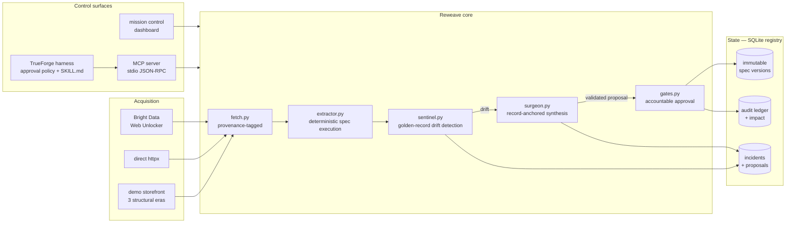
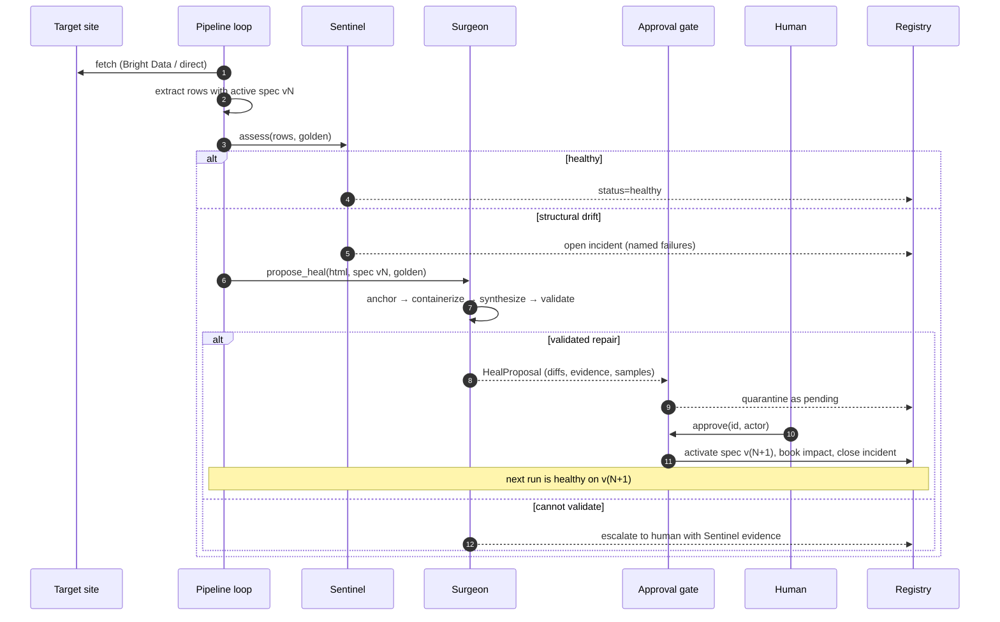
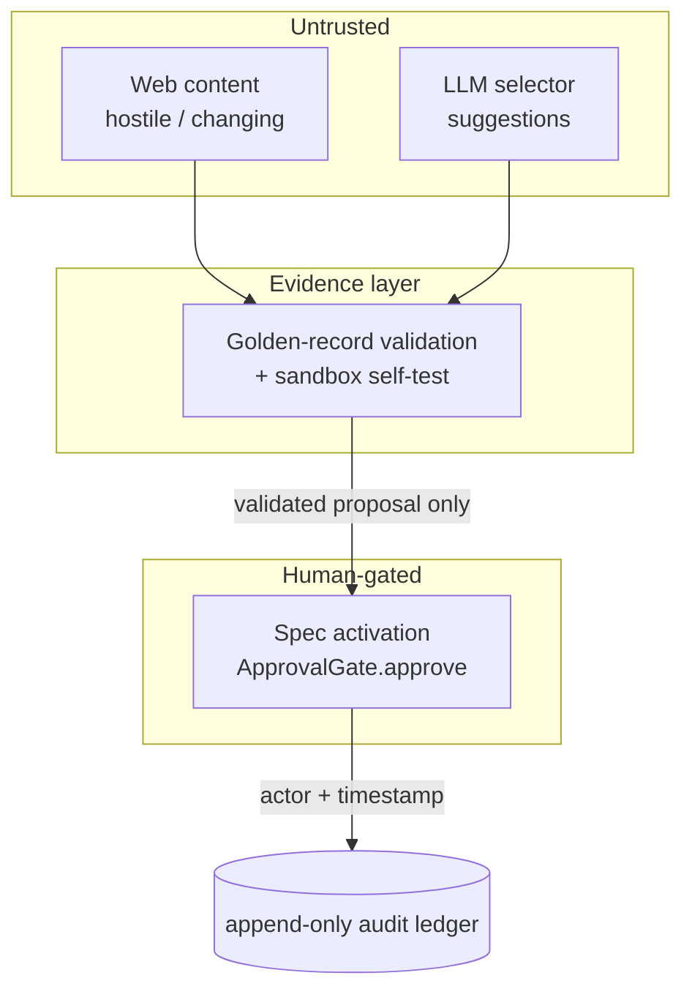

# Reweave architecture

> The runtime layer that keeps web-data pipelines alive when the web changes
> under them — with a human in command of every deploy.

- [System overview](#system-overview)
- [The healing protocol](#the-healing-protocol)
- [Record-anchored selector synthesis](#record-anchored-selector-synthesis)
- [Trust boundaries](#trust-boundaries)
- [MCP surface](#mcp-surface)
- [Data model & versioning](#data-model--versioning)
- [Failure modes](#failure-modes)
- [Impact model](#impact-model)

## System overview

Design rule #1: **the extractor is deliberately dumb.** It executes a
versioned `ExtractionSpec` with zero heuristics. All intelligence lives in the
Surgeon, which *produces* specs. Because execution is deterministic, the diff
between two spec versions completely describes the change in pipeline
behavior — which is exactly what makes a repair reviewable by a human in
30 seconds.

Design rule #2: **state transitions are the API.** Every subsystem communicates
by writing typed records (`DriftReport`, `HealProposal`, …) to the registry.
The dashboard and the MCP surface are both thin views over the same state
machine, so what a human sees at the gate and what a harness agent sees
through `list_pending_heals` are byte-for-byte the same evidence.

## The healing protocol

Two properties worth calling out:

- **Idempotent runs.** A broken source with a pending proposal does not
  re-engage the Surgeon on every cycle; the run reports "awaiting approval."
  Rejection clears the way for a fresh synthesis on the next run.
- **No self-deployment, structurally.** The pipeline loop has no code path
  that activates a spec. Only `ApprovalGate.approve()` moves the active
  pointer, and it hard-fails without an accountable actor.

## Record-anchored selector synthesis

The core insight: **a redesign changes a page's structure but rarely its
facts.** The golden records the Sentinel already maintains — the last known
true (title, price, url) tuples — double as an oracle for re-learning the
structure:

1. **Anchor.** For each golden record, find the deepest DOM nodes whose
   normalized text equals the record's title, whose parsed price equals the
   record's price (decoy-resistant: strikethrough "was" prices and
   concatenated price containers fail numeric parsing), and whose `href` tail
   matches the record's URL slug (path prefixes are allowed to change).
2. **Containerize.** For each anchored title, walk up the ancestor chain to
   the smallest element that also contains that record's price — that element
   is the record's *item card*. This uses containment of two independent
   facts, so grid wrappers and page chrome are structurally excluded.
3. **Generalize.** The cards (and per-field nodes) are compressed into
   candidate CSS selectors from their *shared* signature: common classes,
   common `data-*` attributes, then parent-child paths, in stability order.
   Positional selectors (`nth-child`) are never emitted.
4. **Validate.** Every candidate — including any LLM-suggested one — is
   executed against *all* cards and scored by golden agreement. A field
   selector needs ≥75% agreement; the assembled spec must then pass a full
   Sentinel assessment on the live HTML (the sandbox self-test) before it can
   even become a proposal.

The output is inspectable end-to-end: per-field `old → new` diffs, match
rates, the evidence trail ("anchored 8/8 golden records…"), and sample rows.

**Complexity.** Anchoring is O(nodes × records) with cheap normalization;
generalization and validation are O(cards × candidates). On real pages this
is tens of milliseconds — healing is effectively free compared to one human
context switch.

**Limits (by design).** If the facts themselves vanish — a paywall, a full
content change, JS-only rendering without a fetch layer that executes it —
anchoring fails, no proposal is produced, and the incident escalates to a
human with the Sentinel's full evidence. The system's failure mode is
"asks for help," never "guesses."

## Trust boundaries

- Web content and LLM output share one trust level: **zero**. Both can only
  influence production through the validation layer.
- The approval gate is duplicated at two layers on purpose: the MCP tool
  annotation (`destructiveHint`) lets the *harness* interpose its human
  approval UI, and Reweave's own gate enforces accountability even if a
  harness misbehaves.

## MCP surface

`reweave mcp` serves stdio JSON-RPC 2.0 implementing the MCP methods a
harness needs (`initialize`, `tools/list`, `tools/call`), with zero extra
dependencies.

| Tool | Annotation | What it does |
|---|---|---|
| `list_sources` | read-only | fleet health, active spec versions |
| `run_pipeline` | — | one observe/assess/heal cycle; never deploys |
| `list_pending_heals` | read-only | proposals with diffs + validation evidence |
| `approve_heal` | **destructive** | activate spec v(N+1) — requires `actor` |
| `reject_heal` | **destructive** | discard a proposal — requires `actor` |
| `impact_report` | read-only | audit ledger totals + fleet projection |
| `chaos_break_demo` | — | demo: ship the next redesign era |

[`harness/trueforge.mcp.json`](../harness/trueforge.mcp.json) registers the
server in TrueForge with `approve_heal`/`reject_heal` pinned to
`always_ask`, and [`skills/reweave-operator/SKILL.md`](../skills/reweave-operator/SKILL.md)
gives the harness agent its operating doctrine (never act on the gate without
an explicit human instruction; recommend rejection below 90% validation
confidence; quote impact numbers only from `impact_report`).

## Data model & versioning

- **Specs are immutable.** `specs(source_id, version)` rows are never
  updated; `sources.active_version` is a pointer. Rollback = pointer move.
  History = the full lineage of every selector the pipeline ever ran.
- **Proposals are quarantined state**, not config: `pending → approved |
  rejected` transitions are one-way and stamped with actor + timestamp.
- **Events are append-only.** The dashboard's stream *is* the audit log.
- Local mode is one process + SQLite (mirroring TrueForge's local-mode
  philosophy); the registry API is six functions away from a Postgres
  implementation for fleet mode.

## Failure modes

| Scenario | Behavior |
|---|---|
| Site redesign, facts intact | Heal proposed, human approves, v(N+1) live |
| Partial breakage (one field) | Sentinel names the field; Surgeon re-synthesizes all fields; unbroken fields converge to equivalent selectors |
| Facts gone (paywall, wipe) | No proposal; incident escalates with evidence |
| Fetch blocked (anti-bot) | Route through Bright Data Web Unlocker; provenance recorded |
| Bad approval (human error) | Rollback = activate v(N); ledger shows who/when |
| Duplicate approval | 409 conflict; gate transitions are one-way |
| LLM hallucinates selectors | Candidates fail golden validation; never proposed |

## Impact model

The dashboard's counters are a formula, not a vibe:

- **90 minutes per manual fix** — conservative floor from r/webscraping
  practitioner threads (triage → reproduce → rewrite → test → deploy →
  backfill; community reports run 1–3 hours).
- **$95/hour** — fully-loaded US data-engineering cost.
- **10–15%/week break rate** — the community's own number for fleets of
  scrapers on actively-maintained retail/marketplace sites.

Per approved heal: `90 min × $95/hr = $142.50` booked to the ledger.
Fleet projection (50 scrapers): `50 × 12.5%/wk × 52 wk ≈ 325 breaks/yr ≈
487 engineer-hours ≈ $46,312/yr` — the toil this loop absorbs.
